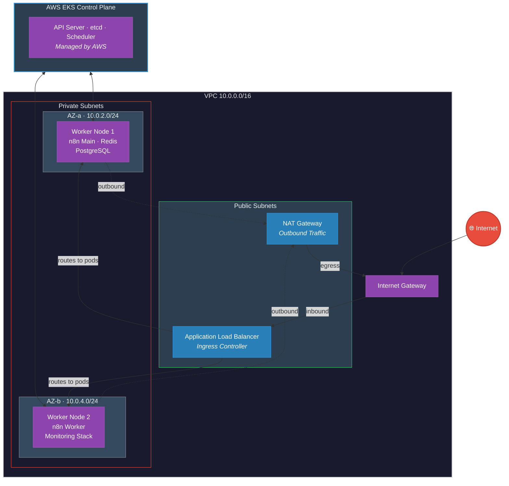
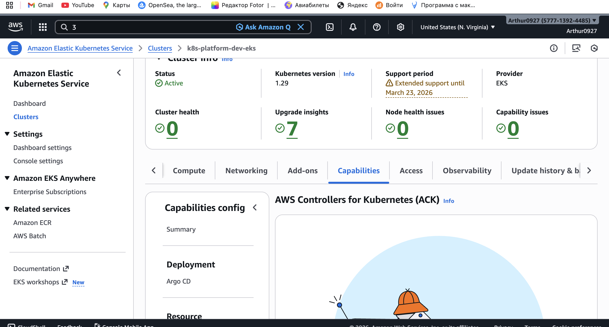
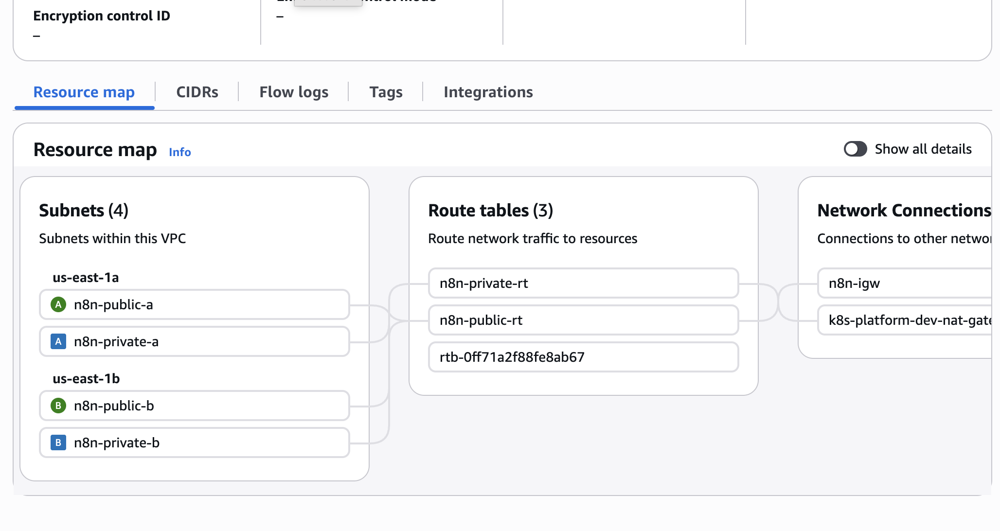
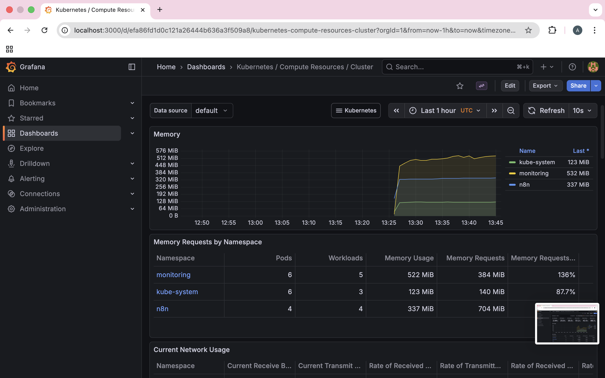
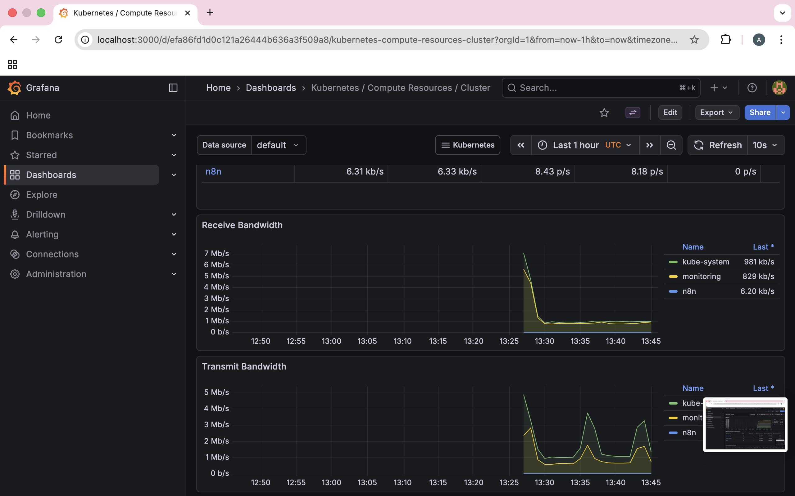
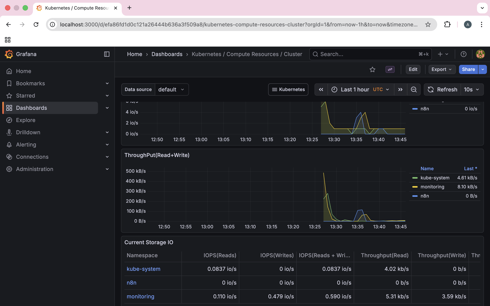
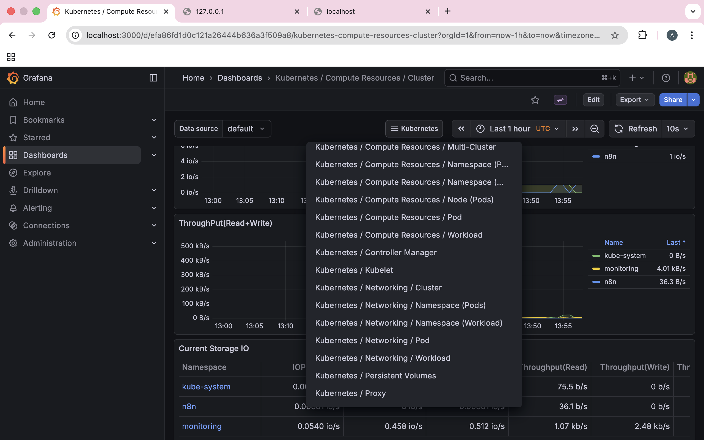
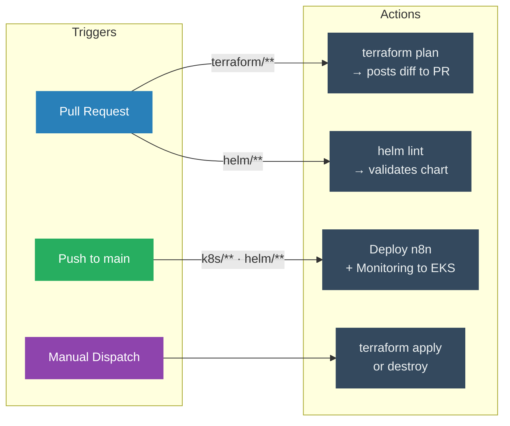

<div align="center">

# ☁️ n8n on AWS EKS — Production-Grade Platform

### Kubernetes · Terraform · CI/CD · Monitoring

[](https://github.com/Artur0927/n8n-eks-platform/actions/workflows/terraform-plan.yml)
[](https://github.com/Artur0927/n8n-eks-platform/actions/workflows/deploy-n8n.yml)
[](https://github.com/Artur0927/n8n-eks-platform/actions/workflows/helm-lint.yml)


</div>

> **End-to-end production deployment** of [n8n](https://n8n.io/) workflow automation on **AWS EKS** — fully automated with **Terraform IaC**, packaged with **Helm**, deployed via **GitHub Actions CI/CD**, and monitored with **Prometheus + Grafana**. Built to demonstrate real-world DevOps and Cloud Engineering skills.

---

## 🎯 Skills Demonstrated

| Area | What This Project Proves |
|:--|:--|
| **Infrastructure as Code** | Full AWS environment (VPC, EKS, NAT, ALB, IAM) provisioned with Terraform — modular, reusable, and production-ready |
| **Kubernetes** | Multi-container application running in queue mode with separate Main, Worker, Redis, and PostgreSQL pods across private subnets |
| **CI/CD Automation** | 4 GitHub Actions workflows: automated `terraform plan` on PRs, manual apply/destroy, Helm lint, and auto-deploy on merge |
| **Networking & Security** | Private subnets for workloads, NAT Gateway for egress, ALB for ingress, IRSA for pod-level IAM, least-privilege security groups |
| **Monitoring & Observability** | Prometheus + Grafana stack with 15+ pre-configured Kubernetes dashboards (CPU, memory, network, storage, pod-level metrics) |
| **Helm Packaging** | Custom Helm chart with templated deployments, configurable values, and Ingress support for ALB |

---

## 🏗️ Architecture



**Queue Mode Flow:**
```
User → n8n Main (UI/API/Webhooks) → Redis (job queue) → n8n Worker (execution) → PostgreSQL (storage)
```

---

## 📸 Live Infrastructure Screenshots

> All screenshots below are from the **actual running infrastructure** deployed by this project.

### EKS Cluster — Active & Healthy



### VPC Route Table — NAT Gateway Routing



### Grafana — Memory Usage by Namespace



### Grafana — Network Bandwidth Monitoring



### Grafana — Storage I/O & Throughput



### Grafana — 15+ Pre-Configured Dashboards



---

## 📦 Stack Components

### Application Layer

| Component | Image | Role |
|:--|:--|:--|
| **n8n Main** | `n8nio/n8n:2.7.3` | UI, webhooks, REST API |
| **n8n Worker** | `n8nio/n8n:2.7.3` | Queue-based workflow execution |
| **PostgreSQL** | `postgres:15-alpine` | Data & credential storage |
| **Redis** | `redis:7-alpine` | Message broker for queue mode |

### Monitoring Stack

| Component | Role |
|:--|:--|
| **Prometheus** | Metrics collection & alerting rules |
| **Grafana** | Dashboards & visualization (15+ K8s dashboards) |
| **Node Exporter** | Host-level metrics (CPU, memory, disk) |
| **kube-state-metrics** | Kubernetes object metrics (pods, deployments) |

### Infrastructure (Terraform)

| Resource | Details |
|:--|:--|
| **VPC** | Multi-AZ, 4 subnets (2 public + 2 private) |
| **NAT Gateway** | AWS-managed with Elastic IP for outbound traffic |
| **ALB Controller** | AWS Load Balancer Controller via IRSA |
| **EKS Cluster** | v1.29, OIDC enabled, private API endpoint |
| **Node Group** | 2× `t3.small` On-Demand, auto-scaling (2–3 nodes) |
| **IAM & Security** | Least-privilege roles, IRSA, security groups |

---

## ⚙️ CI/CD Pipelines



### Required GitHub Secrets

| Secret | Description |
|:--|:--|
| `AWS_ACCESS_KEY_ID` | AWS IAM access key |
| `AWS_SECRET_ACCESS_KEY` | AWS IAM secret key |
| `GRAFANA_PASSWORD` | Grafana admin password |
| `POSTGRES_PASSWORD` | PostgreSQL password |
| `N8N_ENCRYPTION_KEY` | n8n credential encryption key |

---

## 🚀 Quick Start

**Prerequisites:** `AWS CLI v2` · `Terraform ≥ 1.5` · `kubectl v1.29+` · `Helm ≥ 3.14`

```bash
# 1. Clone the repository
git clone https://github.com/Artur0927/n8n-eks-platform.git
cd n8n-eks-platform

# 2. Configure your variables
cp terraform/terraform.tfvars.example terraform/terraform.tfvars
# Edit terraform/terraform.tfvars — set your region, instance types, etc.

# 3. Deploy infrastructure
cd terraform
terraform init
terraform apply

# 4. Configure kubectl (uses your terraform variables automatically)
aws eks update-kubeconfig \
  --region $(terraform output -raw kubectl_config_command | grep -oP '(?<=--region )\S+') \
  --name $(terraform output -raw eks_cluster_name)

# 5. Deploy n8n via Helm
cd ..
helm upgrade --install n8n ./helm/n8n \
  --namespace n8n --create-namespace \
  --set postgres.credentials.password=YOUR_SECURE_PASSWORD \
  --set n8n.encryptionKey=YOUR_ENCRYPTION_KEY \
  --wait --timeout 10m

# 6. Deploy monitoring stack (optional)
helm repo add prometheus-community https://prometheus-community.github.io/helm-charts
helm upgrade --install monitoring prometheus-community/kube-prometheus-stack \
  --namespace monitoring --create-namespace \
  --set grafana.adminPassword=YOUR_GRAFANA_PASSWORD \
  --wait --timeout 5m
```

**Access your services:**
```bash
kubectl port-forward svc/n8n -n n8n 5678:5678           # n8n    → localhost:5678
kubectl port-forward svc/monitoring-grafana -n monitoring 3000:80  # Grafana → localhost:3000
```

<details>
<summary><strong>Optional: Enable Remote State (S3 Backend)</strong></summary>

```bash
# 1. Bootstrap the state bucket
cd terraform/bootstrap
terraform init && terraform apply

# 2. Copy the bucket name from the output
terraform output s3_bucket_name

# 3. Uncomment and update terraform/backend.tf with your bucket name
# 4. Re-initialize: cd .. && terraform init (answer "yes" to migrate state)
```
</details>

---

## 📁 Project Structure

```
n8n-eks-platform/
├── .github/workflows/              # CI/CD Pipelines
│   ├── terraform-plan.yml          #   PR → terraform plan + PR comment
│   ├── terraform-apply.yml         #   Manual → apply / destroy
│   ├── deploy-n8n.yml              #   Push to main → deploy to EKS
│   └── helm-lint.yml               #   PR → lint Helm chart
├── terraform/                      # Infrastructure as Code
│   ├── versions.tf                 #   Provider version constraints
│   ├── variables.tf                #   All configurable inputs
│   ├── terraform.tfvars.example    #   Example variable values
│   ├── provider.tf                 #   AWS / Helm / K8s providers
│   ├── backend.tf                  #   S3 remote state (optional)
│   ├── locals.tf                   #   Computed values
│   ├── vps.tf                      #   VPC, subnets, route tables
│   ├── eks.tf                      #   EKS cluster + node group + OIDC
│   ├── nat.tf                      #   NAT Gateway + Elastic IP
│   ├── alb.tf                      #   ALB Controller (IRSA)
│   ├── security_groups.tf          #   Network security rules
│   ├── outputs.tf                  #   Terraform outputs
│   └── bootstrap/                  #   One-time S3 + DynamoDB setup
├── helm/n8n/                       # Helm Chart
│   ├── Chart.yaml                  #   Chart metadata
│   ├── values.yaml                 #   Default values (override at deploy)
│   └── templates/                  #   Templated K8s resources + Ingress
├── k8s/                            # Raw Kubernetes Manifests (reference)
│   ├── namespace.yaml              #   n8n namespace
│   ├── postgres.yaml               #   PostgreSQL Deployment + Service
│   ├── redis.yaml                  #   Redis Deployment + Service
│   ├── n8n-main.yaml               #   n8n Main (UI/API/Webhooks)
│   └── n8n-worker.yaml             #   n8n Worker (queue executor)
├── docs/screenshots/               # Infrastructure screenshots
└── README.md
```

---

## 📝 Key Design Decisions

| Decision | Rationale |
|:--|:--|
| **NAT Gateway** over NAT Instance | NAT Instance (AL2023) failed IP masquerading; AWS-managed NAT GW is reliable and scalable |
| **Queue Mode** | Separates workflow execution from UI — enables horizontal scaling of workers |
| **Private Subnets** for workloads | Worker nodes are not directly accessible from the internet — enhanced security posture |
| **IRSA** for ALB Controller | Pod-level IAM instead of node-level — follows AWS least-privilege best practices |
| **On-Demand** over Spot | Stability during development; easily switchable to Spot for cost optimization |
| **Private API Endpoint** | Cluster API server not exposed to internet — defense in depth |

---

## 🧹 Cleanup

```bash
kubectl delete namespace n8n monitoring    # Remove K8s resources
cd terraform && terraform destroy -auto-approve   # Destroy infrastructure
```

---

<div align="center">

### 👤 Author

**Artur Martirosyan** — DevOps / Cloud Engineer

[](https://www.linkedin.com/in/artur-martirosyan-54082a394/)
[](https://github.com/Artur0927)

</div>
